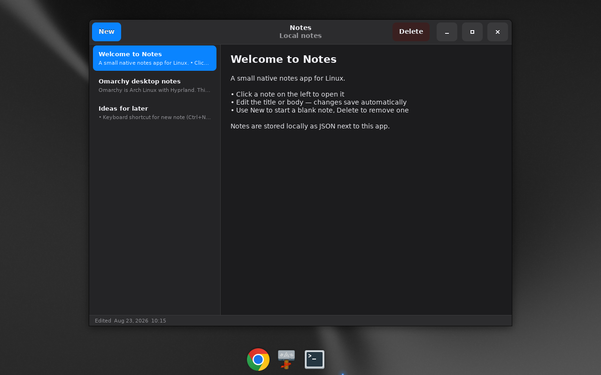

# Notes

A small native GTK3 notes app for Linux. Works on Omarchy (Arch + Hyprland) and any other GTK desktop.



Notes live in a JSON file next to the app. The first launch seeds a few sample notes.

## Run

```bash
python3 notes.py
```

## Requirements

- Python 3
- GTK 3
- Python GObject bindings

On Debian/Ubuntu:

```bash
sudo apt install python3-gi python3-gi-cairo gir1.2-gtk-3.0
```

On Arch / Omarchy:

```bash
sudo pacman -S python-gobject gtk3
```

## Features

- Sidebar list of notes with title + preview
- Title and body editor
- New / Delete
- Autosave to `notes.json`
- Keyboard shortcut: Ctrl+N for a new note
